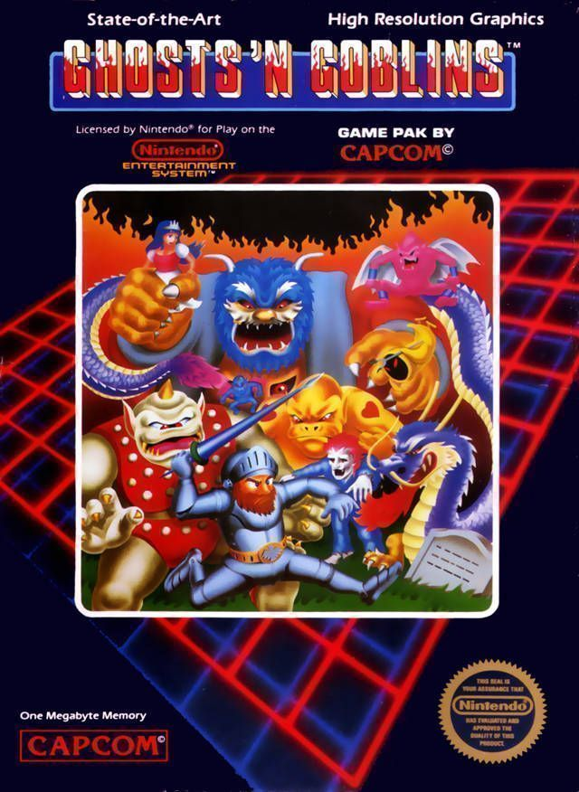

# GHOST-AI-GOBLINS

## Overview

This project represents a study about how to train a Neaural Network to be able to play a retro game as Ghost'n Goblins by itself depending on its own experience towards hundred of tousand of aleatory instructions and the effect that it causes in each instant of time. 

### Why Ghosts'n'Goblins

There is not the first time that someone train a nerual network to play videogame, ussually playig Super Mario Bros or Sonic the Hedgehog.
In this case I wondered if this kind of algorythms were able to play to Super Mario or Sonic, probably could be able to play other videogames that I considered more diffcult to play as is the case of GnG.

## Reinforcement Learning

Reinforcement Learning is one of three basic machine learning paradigms, alongside supervised learning and unsupervised learning.

 It differs from supervised learning in that labelled input/output pairs need not be presented, and sub-optimal actions need not be explicitly corrected. Instead the focus is finding a balance between exploration (of uncharted territory) and exploitation (of current knowledge).