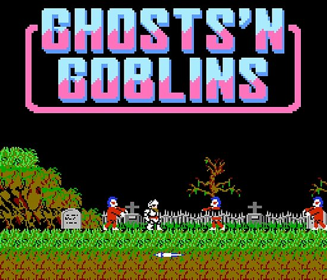
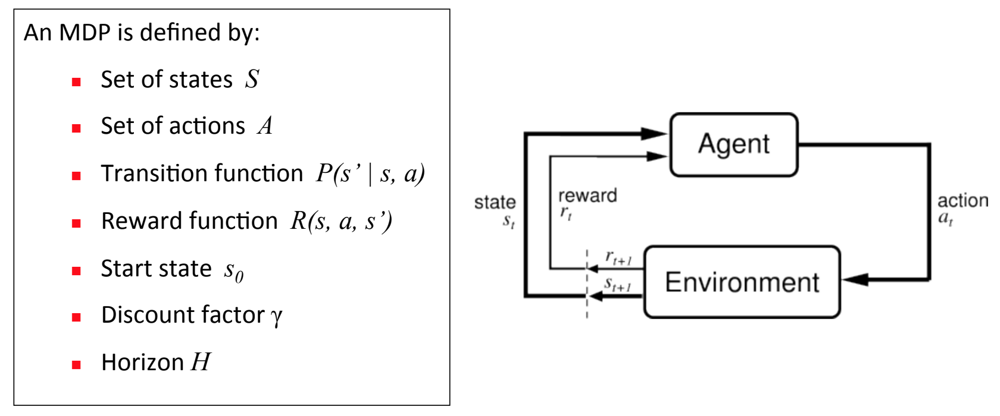

# OPEN-AI plays GHOST'N GOBLINS

## Overview

This project represents a study about how to train a Neaural Network to be able to play a retro game as Ghost'n Goblins by itself depending on its own experience towards hundred of tousand of aleatory instructions and the effect that it causes in each instant of time. 

### Why Ghosts'n Goblins

There is not the first time that someone train a nerual network to play videogame, ussually playig Super Mario Bros or Sonic the Hedgehog.
In this case I wondered if this kind of algorythms were able to play to Super Mario or Sonic, probably could be able to play other videogames that I considered more diffcult to play as is the case of GnG.

## Reinforcement Learning

Reinforcement Learning is one of three basic machine learning paradigms, alongside supervised learning and unsupervised learning.

 It differs from supervised learning in that labelled input/output pairs need not be presented, and sub-optimal actions need not be explicitly corrected. Instead the focus is finding a balance between exploration (of uncharted territory) and exploitation (of current knowledge).

 In most AI topics, we create mathematical frameworks to tackle problems. For RL, the answer is the Markov Decision Process (MDP). It sounds complicated but it produces an easy framework to model a complex problem. An agent (e.g. a human) observes the environment and takes actions. Rewards are given out but they may be infrequent and delayed. Very often, the long-delayed rewards make it extremely hard to untangle the information and traceback what sequence of actions contributed to the rewards.

 

 In this case our environmet will be our Ghost'n golbings game running in OpenAI Gym-Retro environment tool, and our Agent will be a NEAT neural network.

 ## OpenAI Gym-Retro
 [Gym-Retro](https://buildmedia.readthedocs.org/media/pdf/retro/latest/retro.pdf) is a tool developed by Open-AI that provides an esay way to create a retro-gaming environment. It gave to the user a 'friendly' way to build an interaction between our neural network and the game.

 For each instant of time, our environment receives an array of 9 positions of zeros or ones that matches with the 9 buttons of our console gamepad. As a response of this buttons input, it returns to our neural network an image showing the next frame of the game state and a reward acording to our script pecifications.

 ## NEAT
[NeuroEvolution of Augmenting Topologies](http://nn.cs.utexas.edu/downloads/papers/stanley.cec02.pdf) (NEAT) is a genetic algorithm (GA) for the generation of evolving artificial neural networks (a neuroevolution technique) developed by Ken Stanley in 2002 while at The University of Texas at Austin. It alters both the weighting parameters and structures of networks, attempting to find a balance between the fitness of evolved solutions and their diversity. It is based on applying three key techniques: tracking genes with history markers to allow crossover among topologies, applying speciation (the evolution of species) to preserve innovations, and developing topologies incrementally from simple initial structures ("complexifying"). 

## Project Structure
This project is composed by four main scripts:
* __Menu:__ Shows a simple menu to get acces to each functionalitiy of this project.

* __interactive:__ Lets the user play at the game instead of our neural network(script provided by OpenAI retro examples).

* __ai_plays:__ Load the last checkpoit generated by the train srcipt and shows how our IA plays GnG recording each attepmt into a .bk2 file.

* __pararel_train:__ A multithread process that trains our neural network saving checkppoints eache ten generatons, when the max fitting is reached, save the trained neural network in a pickle file and show plots with the statistics about fittin voer all training process and the final network estructure.

* __render_videos:__ convert all .bk2 files to mp4 and delete the old ones in order to get an easy way to see the lasts attempts of our IA playing.

 

 